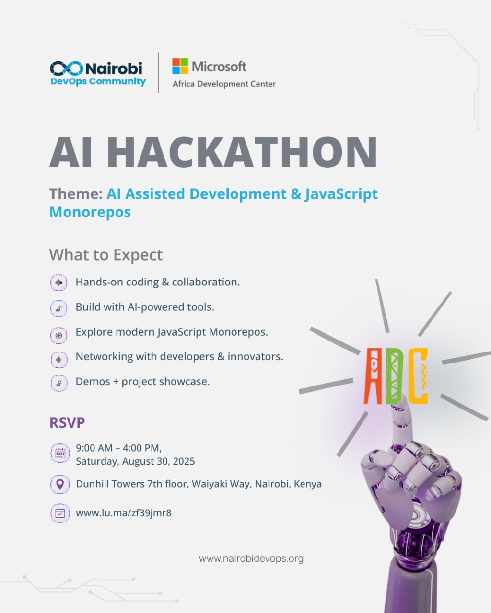

# AI Hackathon Judges Guide  

Welcome to the AI Hackathon! 

This guide is designed specifically for our **judges**. It contains all the information you need to evaluate projects fairly and consistently, including the timetable, judging criteria, and resources.  

---

## Table of Contents  

- [Prerequisites](#prerequisites)  
- [Hackathon Timetable](#hackathon-timetable)  
- [Judging Criteria](#judging-criteria)  
- [Resources](#resources)  

---

## Prerequisites  

Before the hackathon, please ensure:  
- You are familiar with the **judging criteria**.  
- You can attend the **judges’ briefing session** before presentations begin.  

---

## Hackathon Timetable  

| Time          | Activity                            | Notes |
|---------------|-------------------------------------|-------|
| **09:00 - 09:30** | Judges Briefing & Orientation        | Overview of criteria & scoring |
| **10:00 - 16:00** | Team Hacking Session                | Judges may observe |
| **15:30 - 16:00** | Project Presentations & Demos       | Each team presents, Scoring |

---

## Judging Criteria  

Judges will score each project on a **1–10 scale** for each category:  

1. **Innovation (25%)**  
   - Is the solution creative and original?  
   - Does it address the problem in a novel way?  

2. **Technical Implementation (25%)**  
   - Is the codebase well-structured?  
   - Was the solution challenging to build?  
   - Use of AI/ML techniques where applicable.  

3. **Impact & Usefulness (25%)**  
   - Does the solution solve a real-world problem?  
   - Who benefits from this solution?  

4. **Presentation & Communication (15%)**  
   - Was the demo clear and engaging?  
   - Did the team explain their work effectively?  

5. **Microsoft Tools Integration (10%)**  
   - Did the team incorporate Microsoft free/open-source tools (e.g., VS Code, Azure AI Studio, GitHub Copilot)?  

---

## Resources  

- [Microsoft AI Tools](https://learn.microsoft.com/en-us/ai/)  
- [Hackathon Rules](./JUDGES-RULES.md)  

---

Thank you for your time and expertise! 
Your role as a judge ensures fairness, motivation, and recognition for our amazing participants.  

---

